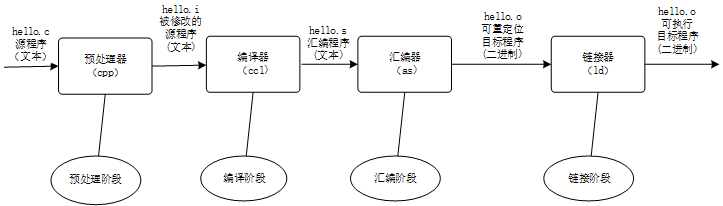

# 借助 gcc 理解编译系统（compilation system）

## 1 编译系统(gcc)概述

通常，使用 gcc 编译程序 ```gcc hello.c -o hello``` 可以直接得到可执行的二进制文件 *hello*。然而，程序从源文件（文本）到可执行文件（二进制文件）要经历以下阶段:预处理，编译，汇编，链接，每个阶段处理后，都会得到新的文件，新的文件记录当前操作的信息，并且用于生成下一步操作。

编译系统由预处理器、编译器、汇编器和链接器组成，它将源程序文件“翻译”为二进制的可执行目标程序。编译系统工作流程及生成的文件如图所示。



在 gcc 中，每个阶段的操作见表1.

<center>表1 编译系统命令

|操作|命令|备注|
|-|-|-|
|预处理| ```gcc -E```   | -E -DXXX 定义XXX|
|编译  | gcc -S   |生成汇编文件    |
|汇编  | gcc -c   |生成机器码      |
|链接  | gcc      |生成可执行文件  |
</center>

## 2 编译系统(gcc)详述

*f_sum.h* 的内容是：
```c
int f_sum(int a, int b) {
    return a+b;
}
```
*hello.c* 的内容是：

```c
#include <stdio.h>
#include "f_sum.h"

int main() {
    int var_sum = 0;
    printf ("makefile OK!\n");
    var_sum = f_sum(2,3);
    printf ("Sum is %d\n",var_sum);
    return 0;
}
```

### 2.1 源程序
利用 *hexdump* 命令可以查看源程序对应的 ASCII 码（以及对应程序源码）。

```hexdump -C  hello.c``` 输出如下：

```
00000000  23 69 6e 63 6c 75 64 65  20 3c 73 74 64 69 6f 2e  |#include <stdio.|
00000010  68 3e 0a 23 69 6e 63 6c  75 64 65 20 22 66 5f 73  |h>.#include "f_s|
00000020  75 6d 2e 68 22 0a 0a 2f  2f 69 6e 74 20 66 5f 73  |um.h"..//int f_s|
00000030  75 6d 28 69 6e 74 20 61  2c 69 6e 74 20 62 29 3b  |um(int a,int b);|
00000040  0a 0a 69 6e 74 20 6d 61  69 6e 28 29 20 7b 0a 20  |..int main() {. |
00000050  20 20 20 69 6e 74 20 76  61 72 5f 73 75 6d 20 3d  |   int var_sum =|
00000060  20 30 3b 0a 20 20 20 20  70 72 69 6e 74 66 20 28  | 0;.    printf (|
00000070  22 6d 61 6b 65 66 69 6c  65 20 4f 4b 21 5c 6e 22  |"makefile OK!\n"|
00000080  29 3b 0a 20 20 20 20 76  61 72 5f 73 75 6d 20 3d  |);.    var_sum =|
00000090  20 66 5f 73 75 6d 28 32  2c 33 29 3b 0a 20 20 20  | f_sum(2,3);.   |
000000a0  20 70 72 69 6e 74 66 20  28 22 53 75 6d 20 69 73  | printf ("Sum is|
000000b0  20 25 64 5c 6e 22 2c 76  61 72 5f 73 75 6d 29 3b  | %d\n",var_sum);|
000000c0  0a 20 20 20 20 72 65 74  75 72 6e 20 30 3b 0a 7d  |.    return 0;.}|
*
000000d1
```
可以看到，*hello.c* 的长度是 0xd1 字节。

### 2.2 预处理阶段

预处理阶段完成的工作有，头文件的插入、宏定义的展开及条件编译的处理。

预处理的命令是 ```gcc -E```，执行如下命令,

 ```gcc -E hello.c -o hello.i```

查看 ```hello.i``` 的内容如下(不加上 -o hello.i 就会直接显示预处理结果，和下面相同)：

```
(省略大量 stdio.h 的代码)
......
# 868 "/usr/include/stdio.h" 3 4

# 2 "hello.c" 2
# 1 "f_sum.h" 1

# 1 "f_sum.h"
int f_sum(int a, int b) {
    return a+b;
}
# 3 "hello.c" 2

int main() {
    int var_sum = 0;
    printf ("makefile OK!\n");
    var_sum = f_sum(2,3);
    printf ("Sum is %d\n",var_sum);
    return 0;
}
```
观察宏定义展开及条件条件编译的源程序 ```test_gcc_e.c``` 的内容如下：
```
#include <stdio.h>

#define LENGTH 1024

int main(void) {
#ifdef TEST
    printf ("TEST Defined!\n ");
#endif

    printf ("Value of LENGTH is %d\n",1024);

    return 0;
}

```
执行 ```gcc -E test_gcc_e.c``` 得到：
```
......(省略的代码)
int main(void) {
    printf ("Value of LENGTH is %d\n",1024);

    return 0;
}
```
可以看到 LENGTH 的 值经过预处理已经被替换为 1024。

执行 ```gcc -E -DTEST```

```
int main(void) {

    printf ("TEST Defined!\n "); //TEST defined


    printf ("Value of LENGTH is %d\n",1024);

    return 0;
}
```

### 2.3 编译阶段

编译得到汇编程序，文件后缀为 *.s*，命令是 ```gcc -S```，执行 ```gcc -S hello.i``` 或者 ```gcc -S hello.c``` ，有：
```

        .file   "hello.c"
        .text
        .globl  f_sum
        .type   f_sum, @function
f_sum:
.LFB0:
        .cfi_startproc
        pushq   %rbp
        .cfi_def_cfa_offset 16
        .cfi_offset 6, -16
        movq    %rsp, %rbp
        .cfi_def_cfa_register 6
        movl    %edi, -4(%rbp)
        movl    %esi, -8(%rbp)
        movl    -4(%rbp), %edx
        movl    -8(%rbp), %eax
        addl    %edx, %eax
        popq    %rbp
        .cfi_def_cfa 7, 8
        ret
        .cfi_endproc
.LFE0:
        .size   f_sum, .-f_sum
        .section        .rodata
.LC0:
        .string "makefile OK!"
.LC1:
        .string "Sum is %d\n"
        .text
        .globl  main
        .type   main, @function
main:
.LFB1:
        .cfi_startproc
        pushq   %rbp
        .cfi_def_cfa_offset 16
        .cfi_offset 6, -16
        movq    %rsp, %rbp
        .cfi_def_cfa_register 6
        subq    $16, %rsp
        movl    $0, -4(%rbp)
        leaq    .LC0(%rip), %rdi
        call    puts@PLT
        movl    $3, %esi
        movl    $2, %edi
        call    f_sum
        movl    %eax, -4(%rbp)
        movl    -4(%rbp), %eax
        movl    %eax, %esi
        leaq    .LC1(%rip), %rdi
        movl    $0, %eax
        call    printf@PLT
        movl    $0, %eax
        leave
        .cfi_def_cfa 7, 8
        ret
        .cfi_endproc
.LFE1:
        .size   main, .-main
        .ident  "GCC: (Ubuntu 7.5.0-3ubuntu1~18.04) 7.5.0"
        .section        .note.GNU-stack,"",@progbits

```
程序主要分为 LFB0、LFB1 两个模块，分别是 f_sum.h 和 main.c 对应的汇编代码。
其中 ```call    puts@PLT``` 调用的是 *printf* 函数，
```
movl    $3, %esi
movl    $2, %edi
call    f_sum
```
```call f_sum``` 调用的是 *f_sum* 函数，f_sum 中执行 addl 是求和运算。
### 2.4 汇编阶段

汇编阶段用汇编文件生成机器码，命令是 ```gcc -c ```。

执行 ```gcc -c hello.s``` 得到 *hello.o*，执行 ```objdump -d hello.o``` 查看 *hello.o* 内容，
```
hello.o：     文件格式 elf64-x86-64
Disassembly of section .text:

0000000000000000 <f_sum>:
   0:   55                      push   %rbp
   1:   48 89 e5                mov    %rsp,%rbp
   4:   89 7d fc                mov    %edi,-0x4(%rbp)
   7:   89 75 f8                mov    %esi,-0x8(%rbp)
   a:   8b 55 fc                mov    -0x4(%rbp),%edx
   d:   8b 45 f8                mov    -0x8(%rbp),%eax
  10:   01 d0                   add    %edx,%eax
  12:   5d                      pop    %rbp
  13:   c3                      retq

0000000000000014 <main>:
  14:   55                      push   %rbp
  15:   48 89 e5                mov    %rsp,%rbp
  18:   48 83 ec 10             sub    $0x10,%rsp
  1c:   c7 45 fc 00 00 00 00    movl   $0x0,-0x4(%rbp)
  23:   48 8d 3d 00 00 00 00    lea    0x0(%rip),%rdi        # 2a <main+0x16>
  2a:   e8 00 00 00 00          callq  2f <main+0x1b>
  2f:   be 03 00 00 00          mov    $0x3,%esi
  34:   bf 02 00 00 00          mov    $0x2,%edi
  39:   e8 00 00 00 00          callq  3e <main+0x2a>
  3e:   89 45 fc                mov    %eax,-0x4(%rbp)
  41:   8b 45 fc                mov    -0x4(%rbp),%eax
  44:   89 c6                   mov    %eax,%esi
  46:   48 8d 3d 00 00 00 00    lea    0x0(%rip),%rdi        # 4d <main+0x39>
  4d:   b8 00 00 00 00          mov    $0x0,%eax
  52:   e8 00 00 00 00          callq  57 <main+0x43>
  57:   b8 00 00 00 00          mov    $0x0,%eax
  5c:   c9                      leaveq
  5d:   c3                      retq
```
第一行指明目标平台，第二行指出是对机器码的反汇编文件，尖括号 <> 指明对哪个函数的反汇编，左边是机器码，右边是对应的汇编带啊吗。

可以看到在调用函数的语句处，*callq* 指令的地址是 00 00 00 00，并没有填入有效的函数地址，经过链接才填入，此时的文件被称作可重定位目标文件，即各节代码都是以 0 地址作为开始，但是将它们链接在一起时，会放入不重叠的地址空间。

### 2.5 链接阶段

汇编阶段生成的目标机器码并没有填入调用函数的地址，链接阶段完成这一过程。链接阶段为各个模块的目标代码在程序空间（运行时进程空间、虚拟地址）中指定它们独立的、不重叠的位置和区间，这个过程叫做“布局”。对未确定的目标地址，如汇编阶段 *callq* 指令全 0 的地址，需要用布局后的对应的函数地址填充，这个过程称作“重定位”。执行 ```gcc hello.o -o hello``` 生成文件 *hello*，然后执行 ```objdump -d hello``` ，显示如下：
```
000000000000069e <main>:
 69e:   55                      push   %rbp
 69f:   48 89 e5                mov    %rsp,%rbp
 6a2:   48 83 ec 10             sub    $0x10,%rsp
 6a6:   c7 45 fc 00 00 00 00    movl   $0x0,-0x4(%rbp)
 6ad:   48 8d 3d c0 00 00 00    lea    0xc0(%rip),%rdi        # 774 <_IO_stdin_used+0x4>
 6b4:   e8 97 fe ff ff          callq  550 <puts@plt>
 6b9:   be 03 00 00 00          mov    $0x3,%esi
 6be:   bf 02 00 00 00          mov    $0x2,%edi
 6c3:   e8 c2 ff ff ff          callq  68a <f_sum>
 6c8:   89 45 fc                mov    %eax,-0x4(%rbp)
 6cb:   8b 45 fc                mov    -0x4(%rbp),%eax
 6ce:   89 c6                   mov    %eax,%esi
 6d0:   48 8d 3d aa 00 00 00    lea    0xaa(%rip),%rdi        # 781 <_IO_stdin_used+0x11>
 6d7:   b8 00 00 00 00          mov    $0x0,%eax
 6dc:   e8 7f fe ff ff          callq  560 <printf@plt>
 6e1:   b8 00 00 00 00          mov    $0x0,%eax
 6e6:   c9                      leaveq
 6e7:   c3                      retq
 6e8:   0f 1f 84 00 00 00 00    nopl   0x0(%rax,%rax,1)
 6ef:   00

```

将 0x550、0x68a 分别填入 *callq* 地址，对 *f_sum*调用使用了静态链接，在程序创建后就已经确定。查看 *printf* 调用地址发现该地址位于 *section.plt*，并且对应一条跳转指令，这涉及动态链接概念，创建可执行文件时仍不确定 *printf* 所在位置，需要运行时才能确定函数地址，当前暂时只想一个辅助代码的位置 *.plt* 处。
